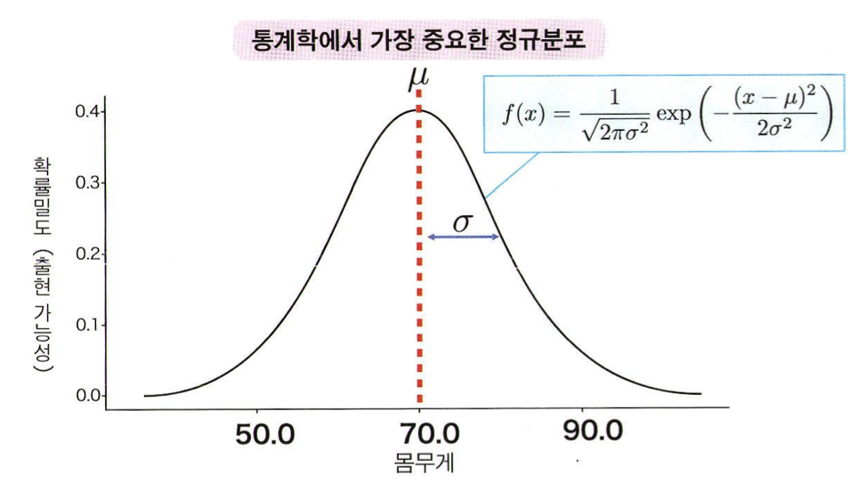
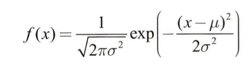

# 이론적인 확률분포
### 01. 확률분포와 파라미터
**확률분포**
- 수식으로 표현
- 파라미터를 가짐 ➡️ 파라미터를 알면 확률분포의 형태를 알 수 있다  

**파라미터**
- parameter, 모수

```
데이터 분석의 목적: 모집단의 성질을 아는 것️

➡️ 모집단을 'ㅇㅇ이라는 파라미터를 가진 ~~이라는 확률분포'로 나타내기
```
### 02. 정규분포
**정규분포 (normal distribution)**



- 확률분포가 평균 μ, 표준편차 σ라는 2개의 파라미터로 정해짐
- <u> 표준정규분포 </u>

  *   평균 μ=0, 표준편차 σ=1인 정규분포 N(0,1)

```
정규분포의 특징
- 평균 μ를 중심으로 한 종형, 좌우대칭 분포
- 평균 μ 근처에 값이 가장 많고, 평균에서 멀어질수록 적어짐
- μ는 분포의 위치를 결정하고, σ는 분포의 너비를 결정함

정규분포의 성질
- μ-σ부터 μ+σ까지의 범위에 값이 있을 확률은 약 68%
- μ-2σ부터 μ+2σ까지의 범위에 값이 있을 확률은 약 95%
- μ-3σ부터 μ+3σ까지의 범위에 값이 있을 확률은 약 99.7%
➡️ 이를 거꾸로 이용해 범위 바깥에 있을 확률도 알아낼 수 있음
```

### 03. 표준화
**표준화 (standardizing, normalizing)**
- 확률변수 x 또는 데이터의 평균 μ(x̄)와 표준편차 σ(s)를 이용하여 평균 0, 표준편차 1로 변환
- z = (x - μ) / σ
- 분포 내의 위치를 알 수 있음 (μ, σ에 상관없이)

```
[예시]
1. 성인 남성의 키 분포 
- μ=167.6, σ=7.0인 정규분포
- 180cm ➡️ z=(180-167.6)/7=1.75

2. 성인 여성의 키 분포
- μ=154.1, σ=6.9인 정규분포
- 170cm ➡️ z=(170-154.1)/6.9=2.3

✅ 평균과의 거리가 더 멀기 때문에, 180cm인 남성보다 170cm인 여성이 더 드물다
```
